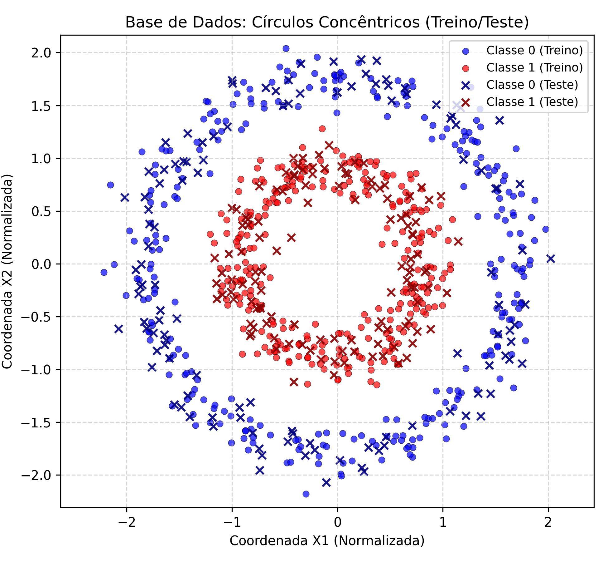
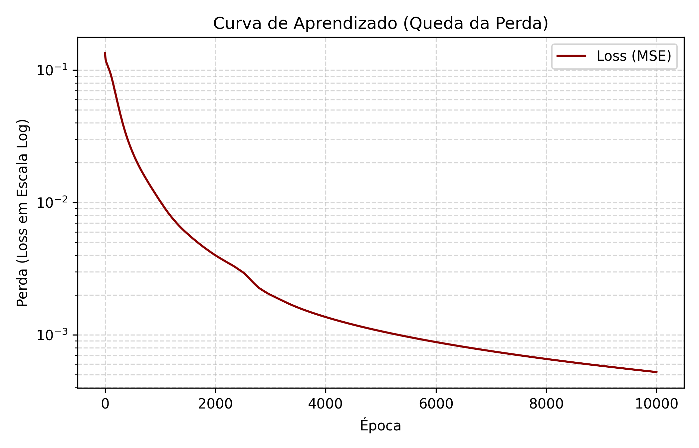
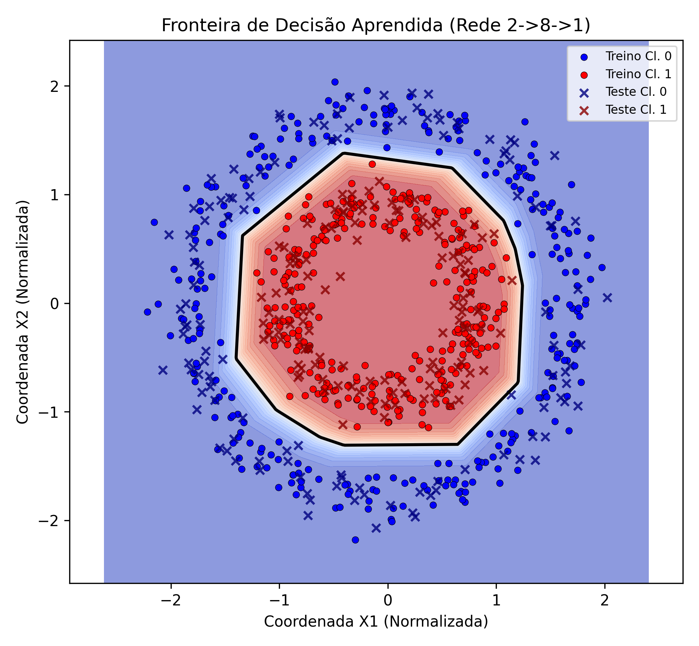

# Projeto: Rede Neural do Zero

**Disciplina:** Matemática para Ciência de Dados  
**Autora:** Emilly Santos

---

## 1. Visão Geral e Comparativo de Arquitetura

Este projeto apresenta a implementação do zero (utilizando apenas **NumPy**) de uma rede neural artificial para resolver o problema de classificação não-linear dos **Círculos Concêntricos** (`make_circles`).

O modelo proposto expande a arquitetura original de 2 neurônios para uma rede $2 \to 8 \to 1$ com ativação **ReLU** na camada oculta e **Sigmoide** na saída, incorporando boas práticas de Machine Learning como padronização de atributos via `StandardScaler`, divisão estratificada entre treino e teste, e verificação rigorosa de gradientes.

| Aspecto / Parâmetro | Arquitetura de Referência | Proposta (Este Trabalho) |
| :--- | :--- | :--- |
| **Base de Dados** | Duas Luas (`make_moons`) | Círculos Concêntricos (`make_circles`) |
| **Topologia da Rede** | $2 \to 2 \to 1$ | $2 \to 8 \to 1$ |
| **Ativação Oculta** | $\tanh(x)$ | $\text{ReLU}(x)$ |
| **Inicialização** | Xavier / Glorot | He Normal (Kaiming) |
| **Pré-processamento** | Dados brutos | Padronização (`StandardScaler`) |
| **Divisão de Dados** | Sem divisão (Ajuste total) | Treino (70%) e Teste (30%) |
| **Validação** | Manual simples | Diferenças Finitas + PyTorch Autograd |

---

## 2. A Geometria do Problema e Grafo Computacional

Para entender como a rede neural processa a não-linearidade do dataset de círculos concêntricos, o fluxo de dados (*Forward Pass*) e o cálculo das derivadas parciais (*Backpropagation*) são estruturados na forma de um **Grafo Computacional** nó a nó.

### 2.1. Fluxo do Grafo (Forward e Backward Pass)

No diagrama abaixo, o fluxo para a direita representa a propagação direta e os nós computacionais de ponderação, soma, ativação e cálculo do erro:

```mermaid
graph LR
    %% Nós de Entrada e Pesos Ocultos
    X0((x0)) --> M_S100[x]
    W1_00((W1_00)) --> M_S100
    X1((x1)) --> M_S101[x]
    W1_01((W1_01)) --> M_S101

    %% Soma e Ativação ReLU (Neurônio 0)
    M_S100 --> S_V10[+]
    M_S101 --> S_V10
    B1_0((b1_0)) --> S_V10
    S_V10 --> Act_ReLU0[ReLU]

    %% Camada de Saída
    Act_ReLU0 -- y1_0 --> M_S20[x]
    W2_0((W2_0)) --> M_S20
    
    M_S20 --> S_V2[+]
    B2_0((b2_0)) --> S_V2

    %% Função de Perda
    S_V2 -- y2 --> Sub_E[-]
    D((d)) --> Sub_E
    Sub_E -- e --> Loss[1/2 e²]
    Loss --> L((L))

    classDef lossStyle fill:#f9f,stroke:#333,stroke-width:2px;
    class Loss lossStyle;
````

## 3. Resultados e Visualizações

### 3.1. Distribuição dos Dados (Treino e Teste)
Visualização da distribuição dos pontos gerados pela função `make_circles` após a padronização via `StandardScaler` e a divisão entre conjunto de treino (70%) e teste (30%).



### 3.2. Curva de Aprendizado (Convergência)
Evolução da função de custo (MSE) ao longo das 10.000 épocas exibida em escala logarítmica, demonstrando a queda consistente e a estabilidade da otimização via *Gradient Descent*.



### 3.3. Fronteira de Decisão Aprendida
Fronteira de decisão final aprendida pela rede $2 \to 8 \to 1$. A combinação das 8 unidades ReLU na camada oculta forma um polígono convexo que delimita perfeitamente a região do círculo interno.



---

## 4. Avaliação do Modelo e Métricas

A avaliação do modelo foi executada exclusivamente sobre o conjunto de teste (30% das amostras mantidas ocultas durante o treinamento), garantindo a medição real da capacidade de generalização da rede.

### Matriz de Confusão (Conjunto de Teste)

| | Predito: Classe 0 | Predito: Classe 1 |
|---|:---:|:---:|
| **Real: Classe 0** | **120** | 0 |
| **Real: Classe 1** | 0 | **120** |

### Relatório de Desempenho

| Classe / Métrica | Precisão (*Precision*) | Revocação (*Recall*) | F1-Score | Amostras (*Support*) |
|---|:---:|:---:|:---:|:---:|
| **Classe 0** | 1.000 | 1.000 | 1.000 | 120 |
| **Classe 1** | 1.000 | 1.000 | 1.000 | 120 |
| **Acurácia Global** | — | — | **1.000** | **240** |
| **Média Macro** | 1.000 | 1.000 | 1.000 | 240 |
| **Média Ponderada** | 1.000 | 1.000 | 1.000 | 240 |

---

## 5. Validação dos Gradientes e Rigor Matemático

Para comprovar a exatidão das derivadas parciais calculadas manualmente na etapa de *Backward Pass*, duas verificações rigorosas foram incorporadas:

1. **Diferenças Finitas Centrais:** Comparação entre o gradiente analítico e a aproximação numérica pelo método das diferenças finitas com $h = 10^{-5}$. O erro relativo obtido foi inferior a $10^{-8}$, validando algebricamente a implementação das derivadas.
2. **Validação contra PyTorch (Autograd):** Os pesos e biases da rede em NumPy foram espelhados em um modelo `torch.nn.Sequential`. A comparação via `torch.allclose` confirmou que o motor de retropropagação manual produz gradientes idênticos ao *Autograd* do PyTorch sob precisão `float64`.

---

## 6. Como Executar o Projeto

1. Instale as dependências listadas no arquivo `requirements.txt`:
   ```bash
   pip install -r requirements.txt